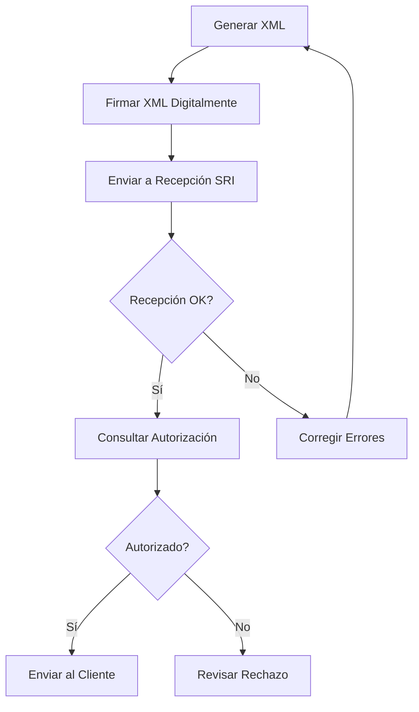

# 📋 Estándares y Especificaciones del SRI

## Tipos de Comprobantes Electrónicos

El SRI de Ecuador acepta los siguientes tipos de comprobantes electrónicos:

### 1. Factura (Código: 01)
- Documento que respalda la transferencia de bienes o prestación de servicios
- Debe contener: información del emisor, receptor, detalles de productos/servicios, impuestos y forma de pago

### 2. Nota de Crédito (Código: 04)
- Documento que anula total o parcialmente una factura
- Motivos: devoluciones, descuentos, anulaciones

### 3. Nota de Débito (Código: 05)
- Documento que incrementa el valor de una factura
- Motivos: intereses por mora, recuperación de costos

### 4. Guía de Remisión (Código: 06)
- Documento que respalda el traslado de mercaderías
- Obligatorio para transporte de bienes

### 5. Comprobante de Retención (Código: 07)
- Documento que respalda las retenciones de impuestos realizadas
- Obligatorio cuando se actúa como agente de retención

## Estructura de la Clave de Acceso

La clave de acceso es un número único de 49 dígitos que identifica cada comprobante:

```
[DD][MM][AAAA][TC][RUC][AMB][SERIE][NÚMERO][COD_NUMERICO][TE][DV]
```

- **DD**: Día de emisión (2 dígitos)
- **MM**: Mes de emisión (2 dígitos)
- **AAAA**: Año de emisión (4 dígitos)
- **TC**: Tipo de comprobante (2 dígitos)
- **RUC**: RUC del emisor (13 dígitos)
- **AMB**: Tipo de ambiente (1: Pruebas, 2: Producción)
- **SERIE**: Establecimiento + Punto de emisión (6 dígitos)
- **NÚMERO**: Número secuencial (9 dígitos)
- **COD_NUMERICO**: Código numérico (8 dígitos)
- **TE**: Tipo de emisión (1: Normal, 2: Por contingencia)
- **DV**: Dígito verificador módulo 11 (1 dígito)

**Total: 49 dígitos**

## Tipos de Identificación

| Código | Descripción |
|--------|-------------|
| 04 | RUC |
| 05 | Cédula |
| 06 | Pasaporte |
| 07 | Consumidor Final |
| 08 | Identificación del Exterior |
| 09 | Placa |

## Códigos de Impuestos

### IVA (Código: 2)

| Código Porcentaje | Tarifa | Descripción |
|-------------------|--------|-------------|
| 0 | 0% | IVA 0% |
| 2 | 12% | IVA 12% (histórico) |
| 3 | 14% | IVA 14% (histórico) |
| 4 | 15% | IVA 15% (actual) |
| 6 | 0% | No objeto de IVA |
| 7 | 0% | Exento de IVA |

### ICE (Código: 3)
Impuesto a los Consumos Especiales - varía según el producto

### IRBPNR (Código: 5)
Impuesto Redimible Botellas Plásticas No Retornables

## Formas de Pago

| Código | Descripción |
|--------|-------------|
| 01 | Sin utilización del sistema financiero |
| 02 | Cheque propio |
| 03 | Cheque certificado |
| 04 | Cheque de gerencia |
| 05 | Cheque del exterior |
| 06 | Débito de cuenta |
| 07 | Transferencia propio banco |
| 08 | Transferencia otro banco nacional |
| 09 | Transferencia banco exterior |
| 10 | Tarjeta de débito |
| 11 | Dinero electrónico Ecuador |
| 12 | Moneda digital |
| 13 | Tarjeta prepago |
| 15 | Compensación de deudas |
| 16 | Tarjeta de crédito |
| 17 | Otros con utilización del sistema financiero |
| 18 | Endoso de títulos |
| 19 | Tarjeta de crédito |
| 20 | Otros con utilización del sistema financiero |
| 21 | Endoso de títulos |

## URLs de los Servicios Web del SRI

### Ambiente de Pruebas (Testing)

```
Recepción: https://celery.sri.gob.ec/comprobantes-electronicos-ws/RecepcionComprobantesOffline?wsdl

Autorización: https://celery.sri.gob.ec/comprobantes-electronicos-ws/AutorizacionComprobantesOffline?wsdl
```

### Ambiente de Producción

```
Recepción: https://cel.sri.gob.ec/comprobantes-electronicos-ws/RecepcionComprobantes?wsdl

Autorización: https://cel.sri.gob.ec/comprobantes-electronicos-ws/AutorizacionComprobantes?wsdl
```

## Estados de Autorización

| Estado | Descripción |
|--------|-------------|
| AUTORIZADO | El comprobante fue autorizado |
| NO AUTORIZADO | El comprobante fue rechazado |
| DEVUELTO | El comprobante tiene errores y fue devuelto |
| RECIBIDA | La recepción del comprobante fue exitosa |
| EN PROCESAMIENTO | El comprobante está siendo procesado |

## Proceso de Emisión de Comprobantes



## Estructura XML de Factura (Simplificada)

```xml
<?xml version="1.0" encoding="UTF-8"?>
<factura id="comprobante" version="1.1.0">
  <infoTributaria>
    <ambiente>1</ambiente>
    <tipoEmision>1</tipoEmision>
    <razonSocial>EMPRESA EJEMPLO S.A.</razonSocial>
    <nombreComercial>EMPRESA EJEMPLO</nombreComercial>
    <ruc>1234567890001</ruc>
    <claveAcceso>49 dígitos</claveAcceso>
    <codDoc>01</codDoc>
    <estab>001</estab>
    <ptoEmi>001</ptoEmi>
    <secuencial>000000001</secuencial>
    <dirMatriz>QUITO, ECUADOR</dirMatriz>
  </infoTributaria>
  
  <infoFactura>
    <fechaEmision>28/02/2026</fechaEmision>
    <dirEstablecimiento>QUITO, ECUADOR</dirEstablecimiento>
    <obligadoContabilidad>SI</obligadoContabilidad>
    <tipoIdentificacionComprador>04</tipoIdentificacionComprador>
    <razonSocialComprador>CLIENTE S.A.</razonSocialComprador>
    <identificacionComprador>9999999999001</identificacionComprador>
    <totalSinImpuestos>100.00</totalSinImpuestos>
    <totalDescuento>0.00</totalDescuento>
    <totalConImpuestos>
      <totalImpuesto>
        <codigo>2</codigo>
        <codigoPorcentaje>4</codigoPorcentaje>
        <baseImponible>100.00</baseImponible>
        <valor>15.00</valor>
      </totalImpuesto>
    </totalConImpuestos>
    <propina>0.00</propina>
    <importeTotal>115.00</importeTotal>
    <moneda>DOLAR</moneda>
    <pagos>
      <pago>
        <formaPago>01</formaPago>
        <total>115.00</total>
      </pago>
    </pagos>
  </infoFactura>
  
  <detalles>
    <detalle>
      <codigoPrincipal>PROD001</codigoPrincipal>
      <descripcion>PRODUCTO EJEMPLO</descripcion>
      <cantidad>1</cantidad>
      <precioUnitario>100.00</precioUnitario>
      <descuento>0.00</descuento>
      <precioTotalSinImpuesto>100.00</precioTotalSinImpuesto>
      <impuestos>
        <impuesto>
          <codigo>2</codigo>
          <codigoPorcentaje>4</codigoPorcentaje>
          <tarifa>15</tarifa>
          <baseImponible>100.00</baseImponible>
          <valor>15.00</valor>
        </impuesto>
      </impuestos>
    </detalle>
  </detalles>
  
  <infoAdicional>
    <campoAdicional nombre="Email">cliente@example.com</campoAdicional>
    <campoAdicional nombre="Teléfono">0999999999</campoAdicional>
  </infoAdicional>
</factura>
```

## Firma Digital XML (XMLDSig)

La firma digital debe cumplir con el estándar XMLDSig y contener:

1. **SignedInfo**: Información sobre el método de firma y canonicalización
2. **SignatureValue**: Valor de la firma digital
3. **KeyInfo**: Información del certificado X.509

```xml
<ds:Signature xmlns:ds="http://www.w3.org/2000/09/xmldsig#" xmlns:etsi="http://uri.etsi.org/01903/v1.3.2#">
  <ds:SignedInfo>
    <ds:CanonicalizationMethod Algorithm="http://www.w3.org/TR/2001/REC-xml-c14n-20010315"/>
    <ds:SignatureMethod Algorithm="http://www.w3.org/2000/09/xmldsig#rsa-sha1"/>
    <ds:Reference URI="#comprobante">
      <ds:Transforms>
        <ds:Transform Algorithm="http://www.w3.org/2000/09/xmldsig#enveloped-signature"/>
      </ds:Transforms>
      <ds:DigestMethod Algorithm="http://www.w3.org/2000/09/xmldsig#sha1"/>
      <ds:DigestValue>...</ds:DigestValue>
    </ds:Reference>
  </ds:SignedInfo>
  <ds:SignatureValue>...</ds:SignatureValue>
  <ds:KeyInfo>
    <ds:X509Data>
      <ds:X509Certificate>...</ds:X509Certificate>
    </ds:X509Data>
  </ds:KeyInfo>
</ds:Signature>
```

## Validaciones Importantes

### RUC
- Longitud: 13 dígitos
- Formato: 10 dígitos del CI/RUC + 001 (contribuyente especial o sociedad) o 000
- Dígito verificador: Validación con algoritmo módulo 11

### Cédula
- Longitud: 10 dígitos
- Dos primeros dígitos: código de provincia (01-24)
- Tercer dígito: menor a 6
- Dígito verificador: Algoritmo de validación específico

### Fechas
- Formato: dd/MM/yyyy
- Ejemplo: 28/02/2026

### Montos
- Formato: Decimal con máximo 2 decimales
- Separador decimal: punto (.)
- Ejemplo: 1234.56

## Archivos XSD (Esquemas)

Los esquemas XSD oficiales del SRI definen la estructura válida de cada tipo de comprobante:

- `factura_v1.1.0.xsd`
- `notaCredito_v1.1.0.xsd`
- `notaDebito_v1.0.0.xsd`
- `guiaRemision_v1.1.0.xsd`
- `comprobanteRetencion_v2.0.0.xsd`

Estos archivos están disponibles en el portal del SRI: https://www.sri.gob.ec/

## Mensajes de Error Comunes

| Código | Descripción | Solución |
|--------|-------------|----------|
| 43 | Clave de acceso no válida | Verificar algoritmo de generación |
| 44 | Número de autorización no válido | Revisar formato de autorización |
| 45 | Fecha de emisión no puede ser mayor a la actual | Ajustar fecha |
| 47 | El establecimiento del comprobante no está registrado | Registrar establecimiento en SRI |
| 58 | RUC del emisor no registrado | Verificar RUC |
| 68 | Certificado digital inválido | Renovar certificado |
| 70 | Error en la estructura del comprobante | Validar contra XSD |

## Recursos Adicionales

- **Portal del SRI**: https://www.sri.gob.ec/
- **Guías Técnicas**: https://www.sri.gob.ec/facturacion-electronica
- **Soporte Técnico SRI**: (02) 3978300 opción 4
- **Email Soporte**: facturacionelectronica@sri.gob.ec

## Actualizaciones Importantes

### IVA 15% (Vigente desde abril 2024)
- Nuevo código de porcentaje: 4
- Tarifa: 15%
- Reemplaza al IVA 12% en la mayoría de transacciones

### Ambiente de Pruebas
- Usar siempre el ambiente de pruebas antes de producción
- Los comprobantes de prueba NO tienen validez tributaria
- No requieren certificados reales para pruebas

---

**Nota**: Esta información está sujeta a cambios según normativas del SRI. Siempre consultar la documentación oficial actualizada en el portal del SRI.
